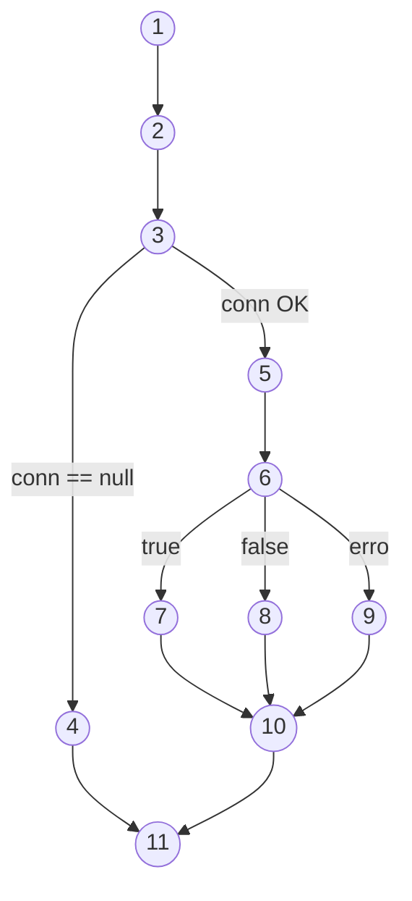

# Atividade individual - Tema: Caixa Branca

Esta atividade tem como objetivo analisar o código disponibilizado previamente pelo professor por meio da **notação de grafo de fluxo**, **complexidade ciclomática** e **caminhos básicos**.

## Planilha de Testes

## 📌 1. Grafo de Fluxo (Mermaid)

## 📌 2. Complexidade Ciclomática

A **complexidade ciclomática** é calculada pela fórmula:

M = E - N + 2

onde:

- E = número de arestas (transições)

- N = número de nós

Ou, alternativamente, somando o número de decisões:

M = D + 1

onde:

D = quantidade de decisões (ifs, loops, catch, condições booleanas)

✔ Contagem de decisões do método

| Decisão | Linha/Descrição|
|---------|----------|
| 1  |`if (conn == null)`|
| 2  |`if (rs.next())`|
| 3  |`Bloco catch (tratamento de erro, considerado decisão no fluxo)`|

Total de decisões: 3

✔ Cálculo

**M = D + 1**

M = 3 + 1

M = 4

* Complexidade ciclomática = 4 *

# 📌 Contagem dos Nós

- N1 – Início do método

Entrada da função verificarUsuario().

- N2 – Inicialização das variáveis

String sql = "" e chamada Connection conn = conectarBD().

- N3 – Verificação da conexão

if (conn == null)

- N4 – Fluxo da conexão nula

Mensagem "Conexão não estabelecida" + return false

- N5 – Construção da instrução SQL

Concatenação das linhas:

select nome from usuarios ...

- N6 – Execução da query

rs = st.executeQuery(sql) e decisão do rs.next():

true

false

exceção

- N7 – Fluxo rs.next() == true

Usuário existe → result = true e nome = ...

- N8 – Fluxo rs.next() == false

Usuário não encontrado → segue sem alterar result

- N9 – Fluxo de Exceção

Bloco catch(Exception e)

- N10 – Fechamento dos recursos / finalização

rs.close(), st.close(), conn.close() (ou fechamento incompleto no caso do catch)

- N11 – Retorno final

return result

# 📌 Contagem das arestas

Vamos contar cada seta do seu grafo:

N1 → N2

N2 → N3

N3 → N4

N4 → N11

N3 → N5

N5 → N6

N6 → N7

N6 → N8

N6 → N9

N7 → N10

N8 → N10

N9 → N10

N10 → N11

**Total de arestas = 13**

# 📌 Caminhos básicos

Complexidade ciclomatica = número de caminhos básicos = 4
(pois há 3 decisões: if(conn==null), rs.next(), e o catch)

Aqui estão os caminhos linearmente independentes:

- 🔹 Caminho 1 — Conexão nula
N1 → N2 → N3 → N4 → N11

- 🔹 Caminho 2 — Conexão OK, rs.next() == false
N1 → N2 → N3 → N5 → N6 → N8 → N10 → N11

- 🔹 Caminho 3 — Conexão OK, rs.next() == true
N1 → N2 → N3 → N5 → N6 → N7 → N10 → N11

- 🔹 Caminho 4 — Conexão OK, erro na execução da query (exceção)
N1 → N2 → N3 → N5 → N6 → N9 → N10 → N11

# 🧾 Conclusão

A análise do método verificarUsuario() permitiu identificar de forma estruturada seu fluxo interno, suas decisões lógicas e seus possíveis caminhos de execução. A partir da criação do grafo de fluxo, foi possível visualizar todos os pontos críticos do código, como validação de conexão, consulta ao banco de dados, tratamento de exceções e retorno final.

Com base no grafo, foi realizada a contagem das arestas e a extração dos caminhos básicos, permitindo calcular a complexidade ciclomática, que para este método foi igual a 4. Esse valor indica que o código possui quatro caminhos independentes que precisam ser testados para garantir cobertura lógica completa. Cada um desses caminhos representa uma situação distinta: conexão inválida, usuário inexistente, usuário válido e erro interno durante a execução da consulta.

Essas informações permitem não apenas melhorar a qualidade dos testes, mas também reforçam a necessidade de aprimoramentos estruturais, como tratamento mais seguro de conexões, uso de PreparedStatement, try-with-resources, redução de riscos de SQL Injection e melhor organização geral da classe.

O estudo demonstra, portanto, que a criação do grafo e o cálculo da complexidade ciclomática são fundamentais para compreender, validar e evoluir o código de maneira segura, clara e orientada a boas práticas de desenvolvimento.
