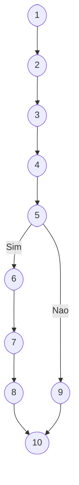

# Teste da Caixa branca - Atividade de UiUx

Para esta atividade avaliativa de UI e UX, precisávamos analisar um código já disponibilizado e montar um grafo e um fluxograma do mesmo.

Logo abaixo, está o grafo de fluxo criado a partir do código da classe `User` dentro da pasta de `Login`, já disponibilizado pela atividade. Com o grafo feito, conseguimos analisar todos os caminhos possíveis, nós e outras informações úteis.

# Grafo de fluxo

```mermaid
flowchart TD
    A1(["1"]) --> A2(["2"])
    A2 --> A3(["3"])
    A3 --> A4(["4"])
    A4 --> A5(["5"])
    A5 -- Sim --> A6(["6"])
    A6 --> A7(["7"])
    A7 --> A8(["8"])
    A8 --> A10(["10"])
    A5 -- Nao --> A9(["9"])
    A9 --> A10
```

Com o grafo de fluxo já montado, podemos avançar para as próximas etapas da atividade, que envolvem **identificar todos os caminhos básicos** e **realizar os cálculos da complexidade ciclomática do código**.

# Complexidade ciclomática

Para calcularmos a Complexidade cilomátida do código precisamos utilizar a fórmula abaixo:

M = E - N + 2P

Onde:

M = Valor da complexidade ciclomática do grafo

E = Número de arestas

N = Número de nós

P = Número de componentes conectados

Com a fórmula em mãos, agora, precisamos identificar cada componente analisando o código e o grafo já feito, com isso, vamos começar analisando quantos nós estão presentes no código:

**N1** = Ínicio do Método

**N2** = Declaração e iniciação da variável `sql`

**N3** = Realização da chamada do método `conectarBD()`

**N4** = Contrói a instrução do SQL

**N5** = Criação do objeto `Statement`

**N6** = Verifica se o resultado da consulta retornou algum dado

**N7** = Quando o resultado é encontrado, defini `result = true`

**N8** = Atribui o valor do campo `nome` obtido do banco à variável `nome`

**N9** = Quando o resultado **não** é encontrado, mantém o valor de `result = false`

**N10** = Retorna o valor de `result` e finaliza o método.  

Com todos os nós devidamente identificados, podemos contar a quantidade de arestas presente no grafo.

De **N1** para **N2**

De **N2** para **N3**

De **N3** para **N4**

De **N4** para **N5**

De **N5** para **N6** (caminho verdadeiro)

De **N5** para **N9** (caminho falso)

De **N6** para **N7**

De **N7** para **N8**

De **N8** para **N10**

De **N9** para **N10**

Totalizando o total de **10 arestas**

E por último, como no grafo podemos ver que todos os **nós** estão conectados de alguma forma (não existe nenhum nó isolado), podemos considerar **P = 1**

Agora, com todos os componentes da fórmula ja indentificados, podemos realizar o cálculo da **`Complexidade ciclomática`**, de modo que:

M = E - N + 2P

`E = 10`
`N = 10`
`P = 1`

M = 10 - 10 + 2 * 1 = 2

A complexidade ciclomática M desse código é **2**, assim como existem **dois caminhos básicos**.

# Caminhos básicos

A complexidade ciclomática também é a quantidade de caminhos básicos presentes no grafo. Analisando o grafo novamente, conseguimos indentificar os caminhos básicos como:

**N1 -> N2 -> N3 -> N4 -> N5 -> N6 -> N7 -> N8 -> N10**
**N1 -> N2 -> N3 -> N4 -> N5 -> N9 -> N10**

